# EEG-Based Signal Classification for Imagery Motor Movement Tasks

## Overview
This project explores EEG-based signal classification for motor imagery tasks using Convolutional Neural Networks (CNNs). The goal is to develop a Brain-Computer Interface (BCI) system capable of decoding neural signals associated with motor imagery, paving the way for applications in assistive technology, neurorehabilitation, gaming, and human-computer interaction.

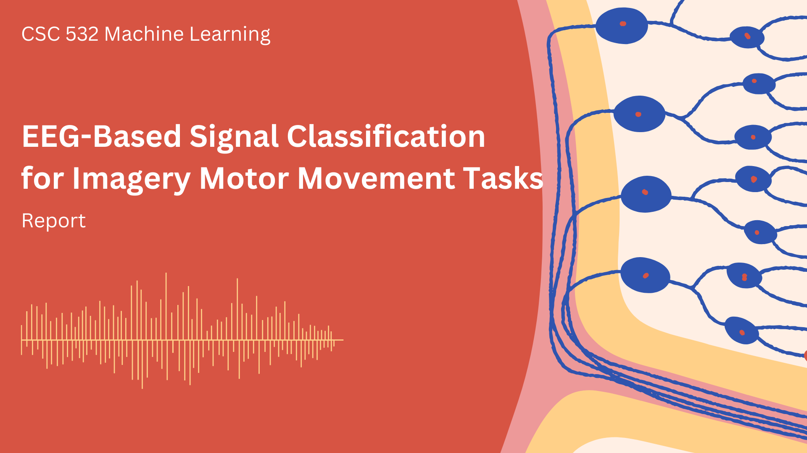 
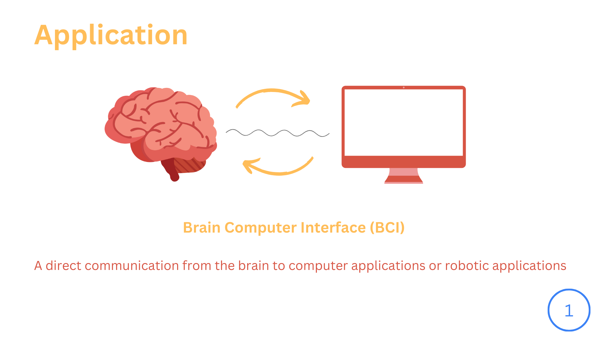 
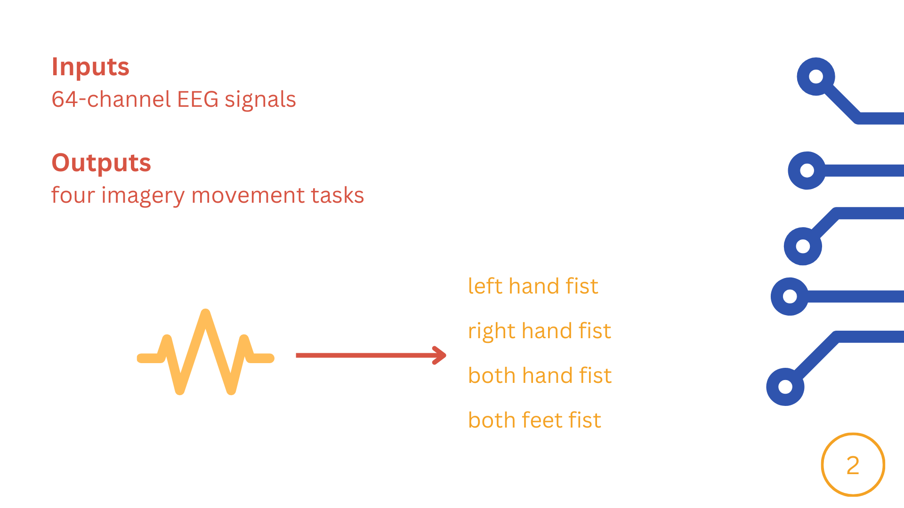 

## Dataset
We use the **EEG Motor Movement/Imagery Dataset** from PhysioNet:
- [EEGMMIDB Dataset](https://physionet.org/content/eegmmidb/1.0.0/)
- 109 subjects, 64-channel EEG setup
- Imagery movement tasks: left hand, right hand, both hands, both feet
- Sampling rate: 160 Hz

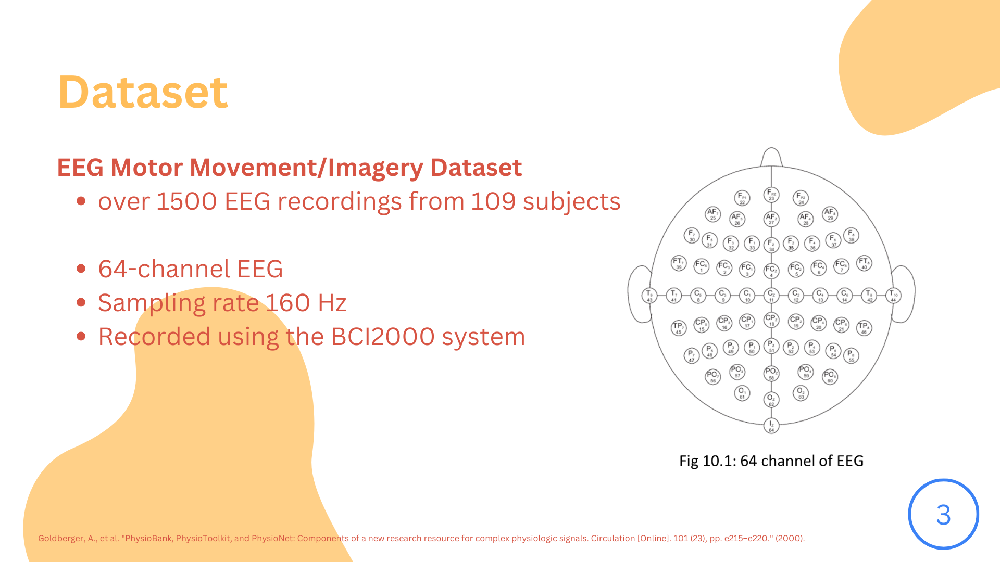 
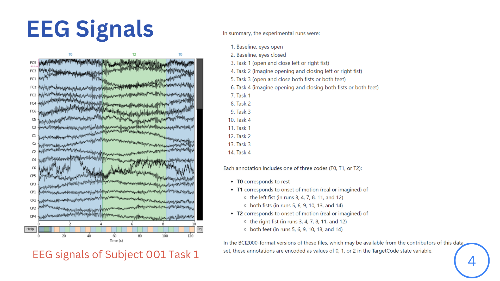 
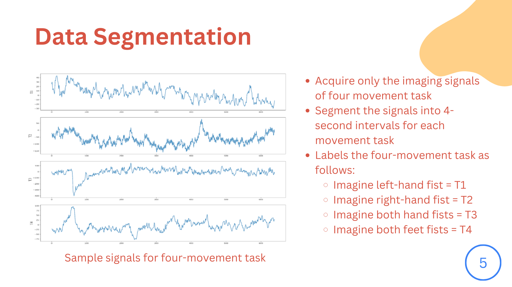 

## Methodology
### 1. Data Acquisition & Preprocessing
- Load EEG recordings and segment them into four classes: left, right, forward, backward
- Filter noise and artifacts
- Normalize signal amplitudes

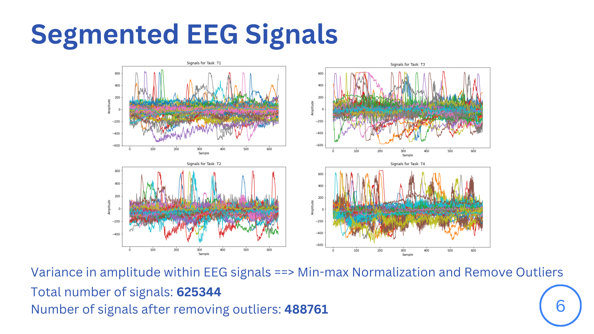 
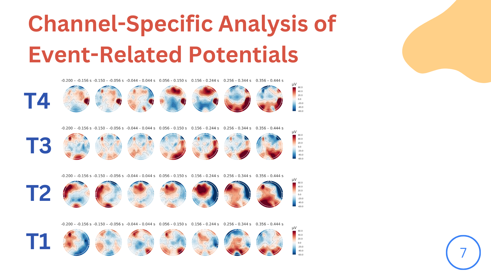 
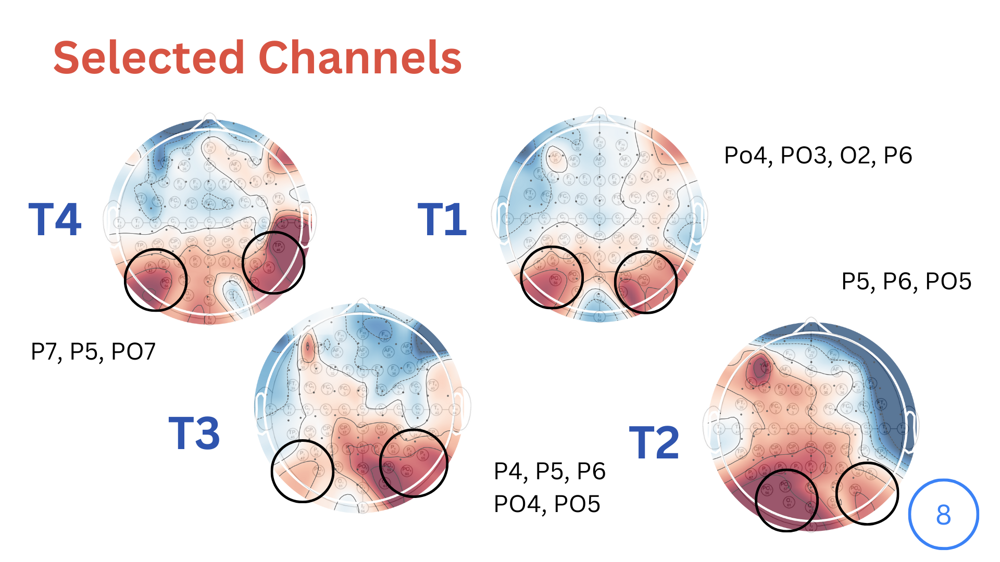 
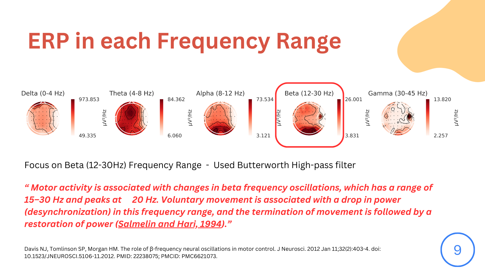 

### 2. Feature Extraction
- **Fast Fourier Transform (FFT):** Extract frequency-domain features
- **Discrete Wavelet Transform (DWT):** Capture time-frequency characteristics
- **CNN Feature Learning:** Extract spatial-temporal patterns from EEG signals

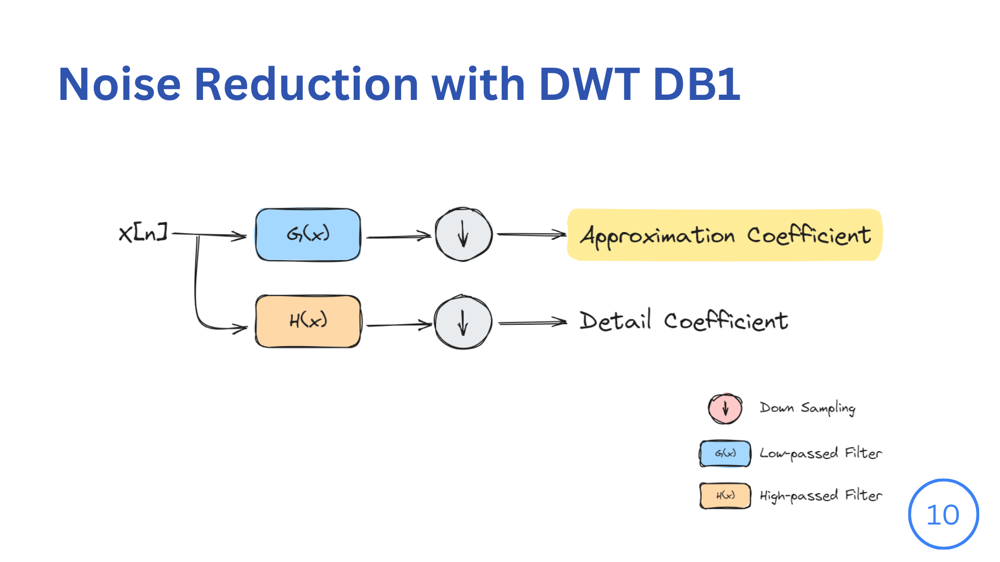 
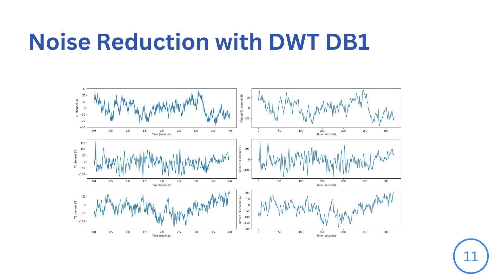
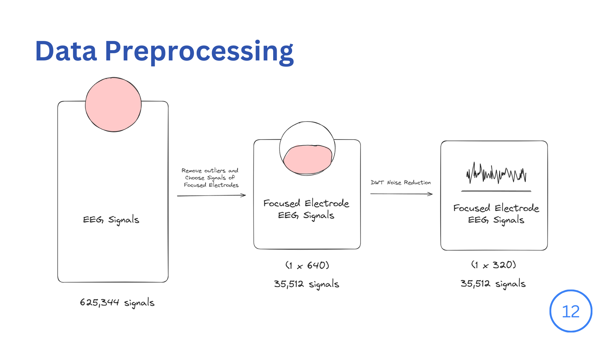 

### 3. Model Training & Evaluation
- **Neural Network Architectures:** CNNs, Hybrid CNN-ANN models
- **Hyperparameter Tuning:** Grid search, dropout, batch normalization
- **Evaluation Metrics:** Accuracy, Precision, Recall, F1-score
- **Cross-validation:** Assess generalization performance

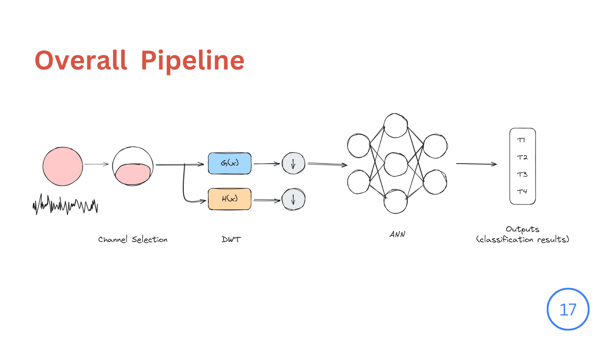 

## Results
- Model comparisons based on evaluation metrics
- Performance visualization using confusion matrices and ROC curves
- Findings interpretation for motor imagery classification

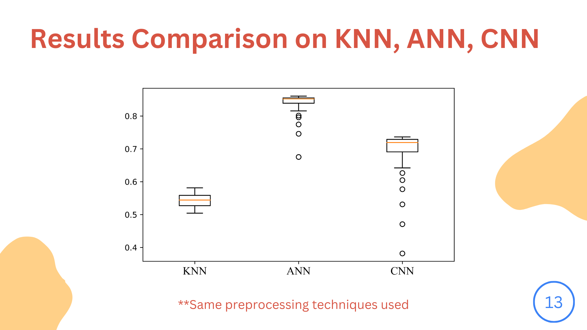 
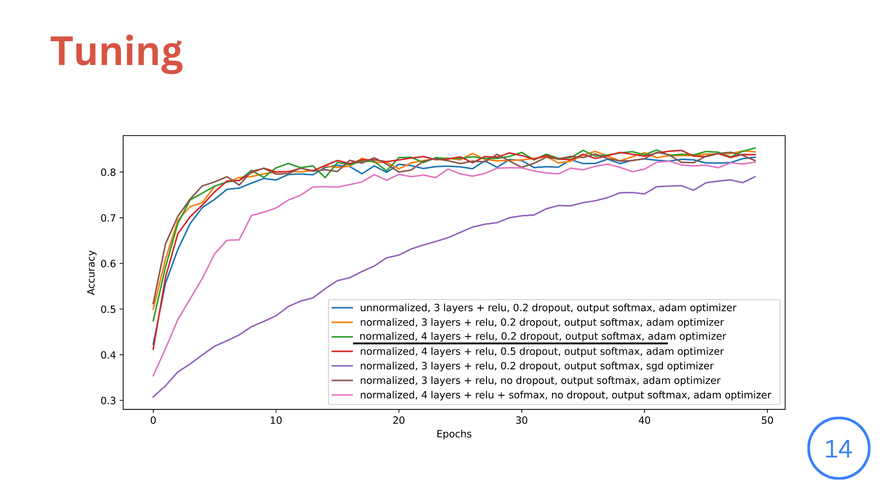 
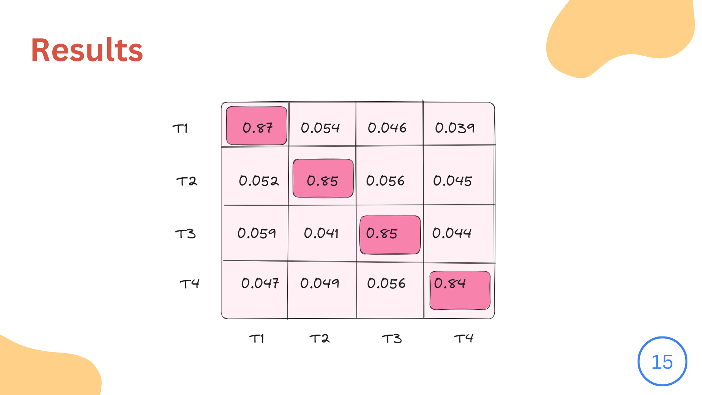 

## Future Work
- Implement real-time EEG signal processing
- Optimize model performance for low-latency applications
- Extend to multi-class motor imagery tasks

## References
- Roohi-Azizi, M., et al. (2017). *Changes of the brain's bioelectrical activity in cognition, consciousness, and some mental disorders.* Medical Journal of the Islamic Republic of Iran, 31, 53.
- Wang, R. (2021). *5 Basics of EEG 101: Data Collection, Processing & Analysis.* iMotions Blog.
- Schalk, G., et al. (2004). *BCI2000: A General-Purpose Brain-Computer Interface System.* IEEE Transactions on Biomedical Engineering.
- Goldberger, A., et al. (2000). *PhysioBank, PhysioToolkit, and PhysioNet.* Circulation.

